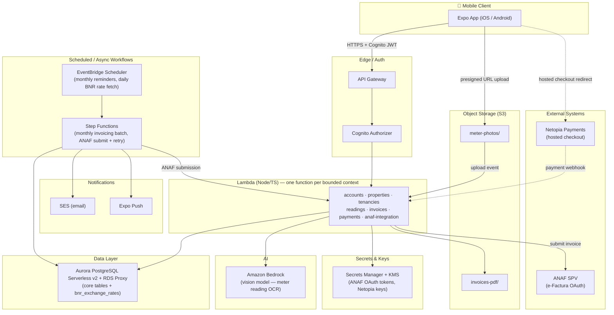

# SPEC.md — Landlord/Tenant Management Platform (B2B / B2C / C2C)

## 1. Purpose and context

An application for managing the landlord–tenant relationship (NOT a listing/booking marketplace). The landlord
creates a profile, adds their portfolio of properties/units and, once the rental relationship already exists
"in fact", invites the tenant into the app to submit monthly meter readings and receive invoices/statements.

Covers three types of contractual relationship on the same platform:

| Type | Description                                             | Invoicing                                  |
|------|------------------------------------------------------------|---------------------------------------------|
| B2B  | Landlord as a legal entity (SRL) ↔ tenant as a company      | Automatic, ANAF e-Factura (SPV OAuth)        |
| B2C  | Landlord as a legal entity/sole trader (PFA) ↔ tenant as an individual | Automatic, ANAF e-Factura (SPV OAuth)      |
| C2C  | Individual ↔ individual, contract not registered with ANAF | Manual — "expense statement" + manual payment marking by the landlord |

## 2. Architecture decisions (summary)

| Domain                    | Decision                                                                  |
|-----------------------------|------------------------------------------------------------------------|
| Mobile                     | React Native + Expo (EAS Build / EAS Update for OTA)                     |
| Backend compute            | Serverless — AWS Lambda + API Gateway + Step Functions                   |
| Database                   | Amazon Aurora PostgreSQL Serverless v2 (+ RDS Proxy)                      |
| Authentication             | AWS Cognito (global identity) — roles/scope live in Postgres, not Cognito |
| AI meter reading            | Amazon Bedrock (vision model), invoked from Lambda                       |
| Online payments            | Netopia Payments (hosted checkout, no card data stored)                  |
| ANAF e-Factura              | Each Account connects its own SPV via OAuth (not a centralized certificate) |
| AWS region                  | eu-west-1 (Ireland)                                                       |
| Notifications               | Push (Expo) + Email (SES)                                                 |
| Delivery                     | Phased: narrow MVP → Phase 1 (AI + notifications) → Phase 2 (ANAF live) → Phase 3 (online payments) |
| Environments                | Single AWS account (eu-west-1); logical DEV/PROD isolation from v1 (separate resource sets + naming/tags, not separate accounts) — extra lower environments (e.g. staging) added the same way on demand |

## 3. Data model — Multi-tenancy and user hierarchy

Core idea: **identity (Cognito) is global and separate from authorization (roles/scope, in Postgres)**. A
person can be a landlord on one account and, at the same time, a tenant on another landlord's unit — with a
single login.

```
users (Cognito sub) ──┬── account_memberships ──> accounts ──> properties ──> units ──> unit_utilities
                       └── tenancy_memberships ──> tenancies ─────────────────────────────┘
```

### 3.1 Core entities

- **users** — `id (cognito_sub)`, `email`, `phone`, `name`. Holds no roles.
- **accounts** — a landlord's portfolio (individual/sole trader/SRL).
  `id`, `name`, `type [B2C_INDIVIDUAL|B2B_COMPANY]`, `legal_name`, `cui_cnp`, `vat_payer bool`,
  `invoice_series`, `invoice_next_number`, `anaf_oauth_status`, `created_by`.
- **account_memberships** — links a user to an account with a role.
  `id`, `account_id`, `user_id`, `role [OWNER|COLLABORATOR|ACCOUNTANT_READONLY]`.
  - `OWNER` → full implicit access, no scope needed.
  - `COLLABORATOR` / `ACCOUNTANT_READONLY` → access **only** to explicit scope (see below). No scope row
    means no access at all (not "full access by default").
- **account_membership_scopes** — `membership_id`, `property_id NULL`, `unit_id NULL`. One row per
  property/unit explicitly assigned to a collaborator.
- **properties** — `id`, `account_id`, `address`, `type [apartment_building|house]`.
- **units** — `id`, `property_id`, `label`, `area_sqm`, `rooms`.
- **unit_utilities** — utility configuration per unit (the toggles set when adding the property).
  `id`, `unit_id`, `utility_type [COLD_WATER|HOT_WATER|GAS|ELECTRICITY|INTERNET|TRASH|MAINTENANCE|OTHER]`,
  `enabled bool`, `tariff_basis [METER_INDEX|FIXED_COST|QUOTA_SHARE|PER_PERSON]`,
  `unit_price` (for METER_INDEX), `fixed_amount` (for FIXED_COST), `quota_percentage` (for QUOTA_SHARE),
  `sequence_order int` — the order used in the photo-capture wizard.
- **tenancies** — the rental contract on a unit.
  `id`, `unit_id`, `start_date`, `end_date`, `contract_type [REGISTERED_ANAF|UNREGISTERED_C2C]`, `status`,
  `rent_amount`, `rent_currency [EUR|RON]` (base rent as negotiated — in Romania typically EUR-indexed even
  when invoiced in RON; kept flexible for contracts already denominated in RON).
- **bnr_exchange_rates** — daily FX reference rates cached from BNR's public feed.
  `id`, `rate_date`, `currency (e.g. EUR)`, `rate_to_ron`. Populated by a scheduled job (see Section 4.6, Section 6); never
  fetched synchronously during invoice generation so the rate used is always reproducible/auditable.
- **tenancy_memberships** — links tenant users to a tenancy (global identity — a user can have
  tenancy_memberships on units belonging to different accounts/landlords).
  `id`, `tenancy_id`, `user_id`, `role [PRIMARY_TENANT|CO_TENANT]`, `invited_at`, `accepted_at`.
- **meter_readings** — a monthly reading for a `unit_utility` within a `tenancy`.
  `id`, `unit_utility_id`, `tenancy_id`, `period (YYYY-MM)`, `photo_s3_key`, `ai_extracted_value`,
  `ai_confidence`, `confirmed_value`, `confirmed_by_user_id`,
  `status [PENDING_AI|PENDING_CONFIRMATION|CONFIRMED|REJECTED]`.
- **invoices** — `id`, `account_id`, `tenancy_id`, `period`, `invoice_type [AUTO_EFACTURA|MANUAL_DECONT]`,
  `series`, `number`, `vat_amount`, `total_amount`, `status [DRAFT|ISSUED|SENT_ANAF|PAID|OVERDUE]`,
  `anaf_upload_id`, `pdf_s3_key`.
- **invoice_lines** — `invoice_id`, `unit_utility_id NULL` (null for the rent line), `description`,
  `quantity`, `unit_price`, `amount`, plus — **only for the rent line** — `source_amount`,
  `source_currency`, `fx_rate_used`, `fx_rate_date` (kept for legal/audit traceability of the EUR→RON
  conversion actually applied).
- **payments** — `invoice_id`, `amount`, `method [MANUAL|NETOPIA_CARD]`, `marked_by_user_id NULL`,
  `netopia_transaction_id NULL`, `paid_at`, `status`.

### 3.2 Permission resolution (on every request)

1. Cognito JWT → `user_id`.
2. Middleware/authorizer loads from Postgres: the user's `account_memberships` (+ scopes) and
   `tenancy_memberships`.
3. Per-endpoint check:
   - Account/property/unit routes: `role=OWNER` on the account → access granted; `role=COLLABORATOR` →
     access only if the requested `property_id`/`unit_id` appears in one of their
     `account_membership_scopes`.
   - Tenancy/reading/my-invoice routes: access granted if an active `tenancy_membership` exists for that
     `tenancy_id`.
4. A user can have 0..N `account_memberships` + 0..N `tenancy_memberships` at the same time → the mobile app
   has an **account/context switcher** in the UI.

## 4. Key flows

### 4.1 Landlord onboarding
Cognito sign-up → create `account` → `account_membership(role=OWNER)`. Fiscal data setup (CUI/CNP, VAT payer
status, invoice series) in Settings.

### 4.2 Adding a collaborator
Owner invites by email → Cognito (`AdminCreateUser` or an acceptance link if the user already exists) →
`account_membership(role=COLLABORATOR)` → UI for scope assignment (selecting properties/units).

### 4.3 Adding a property + unit
Owner creates a `property` → `unit` → toggle list of utilities (cold/hot water, gas, electricity, internet,
trash, maintenance) → for each active utility: tariff basis (index / fixed cost / quota share / per person) +
unit price/fixed amount/percentage + **order in the photo-capture sequence**.

### 4.4 Inviting a tenant & tenancy
Owner creates a `tenancy` on a `unit` → invites a tenant (email/phone) → if the user doesn't exist, Cognito
creates a new account; if they already exist (e.g. a tenant with other units from other landlords), only a
new `tenancy_membership` is created on their existing identity.

### 4.5 Monthly meter reading (mobile wizard)
1. EventBridge Scheduler triggers a reminder (push + email) on a configurable day of the month.
2. The tenant opens the wizard → is shown the unit's active utilities **in `sequence_order`**.
3. Step by step: photograph the current meter → upload directly to S3 (presigned URL, `meter-photos` bucket)
   → Lambda invokes Bedrock (vision) with a prompt specific to the utility type → extracts value + confidence.
4. The tenant confirms/corrects the read value → `meter_reading.status = CONFIRMED` → moves to the next step
   in the sequence.

### 4.6 Invoice generation (monthly, Step Functions)
For each `account`, at the end of the billing cycle:
1. Collect the period's confirmed `meter_readings` for each `tenancy`.
2. **Rent line**: if `tenancy.rent_currency = EUR`, look up `bnr_exchange_rates` for the last published rate
   dated strictly before the invoice issuance date (skips weekends/bank holidays — BNR does not publish on
   non-business days, so this resolves to "last available rate before invoice date", which is the standard
   fiscal reading of "the day before" in Romanian tax practice) → `rent_amount_RON = rent_amount × rate`.
   The `source_amount`, `source_currency`, `fx_rate_used`, `fx_rate_date` are stored on the invoice line for
   audit purposes. If `rent_currency = RON`, no conversion — the line is just `rent_amount`.
3. **Utility lines** (always computed directly in RON, no FX involved): index → `(current - previous) ×
   unit_price`; fixed → `fixed_amount`; quota → `shared_meter_total × quota_percentage`; per person →
   `cost × number_of_occupants`.
4. If `tenancy.contract_type = REGISTERED_ANAF` (B2B/B2C): generate UBL/CII XML, submit to ANAF via the
   account's OAuth token (SPV), store `anaf_upload_id`, generate a PDF, `status = SENT_ANAF`.
5. If `contract_type = UNREGISTERED_C2C`: generate only an "expense statement" PDF (no ANAF submission),
   `status = ISSUED`, awaiting manual payment marking by the landlord.

**BNR rate ingestion**: a daily scheduled Lambda (EventBridge, early morning on business days) fetches BNR's
public reference-rate feed (XML) and upserts into `bnr_exchange_rates`. Because it runs before the monthly
invoicing batch, the previous business day's rate is always already cached — the invoicing Step Function
never calls BNR synchronously.

### 4.7 Payment
- Manual: owner marks the `invoice` as paid → `payment(method=MANUAL, marked_by_user_id)`.
- Online (Netopia): the tenant pays via hosted checkout → Netopia webhook → `payment(method=NETOPIA_CARD)`
  → `invoice.status = PAID`. The application never stores card data (minimal PCI scope, SAQ-A).

### 4.8 Connecting ANAF SPV (per account)
Settings → "Connect ANAF" → redirect to the SPV authorize endpoint → callback Lambda exchanges the `code`
for an `access_token`/`refresh_token` → encrypted storage (Secrets Manager / KMS-encrypted column) →
scheduled Lambda refreshes the token before expiry.

## 5. Mobile application structure

Single Expo/React Native codebase for iOS + Android. Because identity is global (Section 3), the same install of
the app serves a user acting as landlord, collaborator, and/or tenant — the navigation structure and screen
set are role-driven at runtime, not separate apps.

### 5.1 Navigation structure

```
RootNavigator
├── AuthStack (unauthenticated)
│   ├── SignIn / SignUp
│   └── InviteAcceptance (deep link from an email/SMS invite → binds to an
│       existing account_membership or tenancy_membership)
│
└── AppStack (authenticated — Cognito session present)
    ├── ContextSwitcher (top-level, always reachable)
    │   shows every account_membership + tenancy_membership the user has;
    │   picking one scopes everything below to that context
    │
    ├── OwnerTabs (visible when the active context is an account_membership)
    │   ├── Portfolio (properties → units, add/edit, utility toggles + tariff config)
    │   ├── Collaborators (invite, assign property/unit scope)
    │   ├── Tenancies (create tenancy, invite tenant, contract type)
    │   ├── Invoices (list, status, ANAF submission state, mark-paid action)
    │   └── Settings (fiscal data, invoice series/VAT, ANAF connect, Netopia config)
    │
    └── TenantTabs (visible when the active context is a tenancy_membership)
        ├── MyTenancies (units rented, possibly across different landlords)
        ├── ReadingWizard (per Section 4.5 — step-by-step camera capture, sequence_order-driven)
        ├── MyInvoices (view, pay online via Netopia hosted checkout, view receipt)
        └── Notifications (reminders, invoice issued, payment confirmations)
```

A user with both an `account_membership` and a `tenancy_membership` sees both `OwnerTabs` and `TenantTabs`
as separate contexts in the switcher — never merged into one screen, to keep the mental model (and the
authorization scope of every screen) unambiguous.

### 5.2 State management & data layer

- **Server state**: TanStack Query (React Query) for all API data — caching, retries, background refetch;
  matches the Lambda/REST backend directly, no bespoke client-side store duplicating server state.
- **Local/UI state**: React Context + `zustand` for cross-screen UI state that isn't server data (active
  context/account selection, in-progress wizard step).
- **Auth/session**: Cognito tokens (access/refresh) in `expo-secure-store` (Keychain/Keystore-backed, never
  AsyncStorage) — refreshed transparently by the API client on 401.
- **Offline reading capture (per decision below)**: a local SQLite queue (`expo-sqlite`) — see Section 5.3.

### 5.3 Offline-first meter reading capture

Meter cupboards/basements often have poor or no signal, so the reading wizard **must not depend on a live
connection at capture time**:

1. Photo is taken and immediately written to local device storage + a row in a local SQLite `upload_queue`
   table (`unit_utility_id`, `period`, `local_file_uri`, `status: PENDING_UPLOAD`).
2. The wizard advances to the next meter in `sequence_order` immediately — it never blocks on network I/O.
3. A background sync task (foreground task on app resume + `expo-background-fetch` opportunistically)
   drains the queue: requests a presigned S3 URL per pending item, uploads, then marks the row `UPLOADED`
   and triggers the existing upload-event → Bedrock flow (Section 4.5) server-side.
4. AI-extracted values/confidence are pulled back into the app (poll or push) once processed, so the tenant
   can confirm/correct — this confirmation step can itself happen later/offline-first too, with the
   confirmed value queued the same way if still offline.
5. Failure handling: exponential backoff per queue item; the queue survives app restarts/kills (SQLite, not
   in-memory); a visible "N readings pending upload" indicator avoids silent data loss.

### 5.4 Push notifications & deep linking

Expo push token registered post-login, stored server-side against the `user_id` (fan-out target is whichever
context — account or tenancy — the notification concerns). Notifications deep-link directly into the
relevant screen (e.g. a reading reminder opens `ReadingWizard` pre-scoped to that tenancy/period).

### 5.5 Testing & release

- **E2E**: Maestro (camera/upload flows are the highest-risk regression surface — Maestro's device-farm
  friendly, YAML-based flows fit this better than Detox for a small team).
- **EAS Build profiles** mirror the backend environments (Section 8): `development` (dev API, sandbox ANAF/Netopia,
  dev client), `preview` (internal QA builds against `prod`-like staging if/when added), `production` (store
  builds, live API). **EAS Update** channels map 1:1 to these profiles for OTA JS/asset updates without an
  app-store review cycle.

## 6. AWS architecture



AWS services used: Cognito, API Gateway, Lambda, Aurora Serverless v2, RDS Proxy, S3, Bedrock,
Step Functions, EventBridge Scheduler, SES, Secrets Manager, KMS, CloudWatch, X-Ray, WAF.

## 7. Repository structure & tooling

Monorepo containing the mobile app, backend services, shared domain code, and infrastructure:

```
helix-core/
├── apps/
│   └── mobile/              # Expo/React Native app (Section 5)
├── services/
│   └── <name>/              # one Lambda per bounded context (Section 6): accounts, properties, tenancies,
│                            # readings, invoices, payments, anaf-integration, bnr-rates
├── packages/
│   └── domain/              # shared TS types, Zod schemas, Drizzle schema, tariff/FX calculation logic —
│                            # imported by services/invoices and apps/mobile (e.g. bill preview)
├── infra/                   # Terraform (Section 8) — separate tool chain, sibling directory only, not part of
│                            # the JS/TS workspace graph
└── SPEC.md
```

### 7.1 Package manager & task orchestration
- **pnpm workspaces**: internal packages reference each other via `workspace:*` (e.g. `services/invoices`
  depends on `packages/domain`), resolved as local symlinks — no publishing to a registry needed.
- **Turborepo** orchestrates build/test/lint across packages: derives the dependency graph from `workspace:*`
  references, runs tasks in the correct order, and caches per-package outputs (only what changed, and its
  dependents, is rebuilt/retested).
- **Expo/Metro**: pnpm's symlinked `node_modules` requires `apps/mobile/metro.config.js` to set
  `watchFolders` + `resolver.nodeModulesPaths` so Metro resolves workspace-linked packages (a documented
  pattern, not experimental).

### 7.2 Database access layer
- **Drizzle ORM** for Aurora Postgres access from Lambda: schema (tables, enums, relations — Section 3.1) defined
  once in `packages/domain`, consumed as typed queries by every service that needs DB access.
- Chosen over Prisma for lower cold-start overhead (no separate query-engine binary to load per invocation)
  and over raw SQL + hand-rolled migrations for compile-time type safety, while keeping generated queries
  close to plain SQL.

## 8. Terraform — modular structure & environment strategy

**Single AWS account** (eu-west-1) hosts every environment. DEV/PROD isolation is **logical, not
account-level**:

- Every environment-scoped resource is namespaced by prefix (`helix-dev-*`, `helix-prod-*`) — needed anyway
  for globally-unique names (S3 buckets, Cognito domain).
- Separate resource instances per environment: own Cognito User Pool, own Aurora Serverless v2
  cluster/database, own S3 buckets, own API Gateway stage + Lambda aliases, own Step Functions state machines,
  own VPC.
- Terraform: one `environments/<env>/` folder per environment, each with its own `.tfvars` and its own remote
  state path (separate S3 state key + DynamoDB lock entry) — same backend account/bucket, different state
  path per environment, so an `apply` in dev can never touch prod state.
- IAM: policies/conditions scoped by naming convention/tags (`Environment = dev|prod`) so that, even within
  the same account, a dev-scoped Lambda role cannot read/write prod-tagged resources (enforced via S3 bucket
  policies, KMS key policies, Secrets Manager resource policies).
- Secrets (ANAF OAuth client credentials, Netopia API keys) are stored per environment in Secrets Manager
  under an environment-prefixed path (`/dev/anaf/...`, `/prod/anaf/...`) — pointing at ANAF's SPV **sandbox**
  and Netopia's **sandbox** keys in dev, and the live endpoints/keys in prod.
- Extra lower environments (e.g. `staging`) follow the exact same pattern — just another
  `environments/staging/` folder and another tag value; no architectural change required.

```
infra/
  modules/
    network/        # VPC, private subnets (Aurora + Lambda ENI), NAT — one VPC per environment, same account
    database/       # Aurora Serverless v2, RDS Proxy, Secrets Manager (DB creds)
    auth/            # Cognito User Pool + App Clients (one pool per environment)
    storage/         # S3: meter-photos (lifecycle), invoices-pdf (env-prefixed bucket names)
    api/             # API Gateway + Lambda functions + per-function IAM roles
    workflows/       # Step Functions state machines + EventBridge rules
    messaging/       # SES domain/identity config
    observability/   # CloudWatch dashboards + alarms, X-Ray
  environments/
    dev/             # tfvars + own state key, sandbox ANAF/Netopia credentials
    prod/            # tfvars + own state key, live ANAF/Netopia credentials
    # staging/       # added later if needed, same pattern — no module changes required
```

Each module exposes the minimum outputs the others need (e.g. `database` exposes the connection info via a
Secrets Manager ARN, never in plain text). Remote state in S3 + DynamoDB lock table (single account,
eu-west-1), one state path per environment.

## 9. Security & compliance

- **Personal data**: CNP, address — column-level encryption (KMS) in Aurora, restricted access.
- **GDPR**: data resident in eu-west-1; right-to-erasure process on request; limited retention for meter
  photos (S3 lifecycle → archive/delete after N months).
- **ANAF OAuth tokens**: encrypted (Secrets Manager or KMS-encrypted column), scoped per `account`, auto-refreshed.
- **Payments**: Netopia hosted checkout — the application never touches/stores card data (SAQ-A, minimal PCI
  scope).
- **IAM**: least privilege per Lambda (each function has its own role, no wildcards).
- **API**: AWS WAF on API Gateway, rate limiting, Cognito JWT authorizer on all private routes.

## 10. Phased roadmap

### Phase 0 — MVP
- Cognito auth, complete data model (accounts/memberships/scopes/properties/units/tenancies).
- Base Terraform: network, database, auth, api, storage — provisioned for **both `dev` and `prod`** (single
  AWS account, logically isolated per Section 8) from day one, not retrofitted later.
- Mobile: onboarding, property/unit CRUD, inviting collaborators/tenants, account switcher.
- **Manual** meter reading (numeric input, no photo/AI yet).
- Basic invoicing: computation + PDF, **no** live ANAF submission (manual payment marking for all contract types).

### Phase 1 — AI & notifications
- Photo upload to S3 + step-by-step wizard (`sequence_order`) + automatic reading via Bedrock + user confirmation,
  with the offline-first capture queue from day one (Section 5.3) — not a later hardening pass.
- EventBridge monthly reminders, push notifications (Expo) + email (SES).
- Step Functions for the monthly billing cycle.

### Phase 2 — ANAF live
- SPV OAuth per account, automatic e-Factura submission for B2B/B2C (UBL/CII XML).
- Formalized "expense statement" flow for C2C (no ANAF submission).

### Phase 3 — Online payments & extras
- Netopia integration (checkout + webhook reconciliation).
- Reporting/analytics dashboard for landlords.
- (Optional, on demand) SMS channel, custom granular per-action roles.

## 11. Confirmed decisions (previously open assumptions)

- **Language/currency**: UI in Romanian; invoices in RON. Rent is commonly negotiated in EUR (standard
  Romanian market practice) even though it's invoiced in RON — see the `rent_currency` field and the BNR
  conversion rule in Section 3.1/Section 4.6. Utility charges are always computed and invoiced directly in RON (meter
  delta × unit price), never FX-converted.
- **FX rate convention**: the rent's EUR→RON conversion uses the last BNR reference rate published before
  the invoice's issuance date (falls back across weekends/bank holidays to the last available rate) — this
  is the standard Romanian fiscal reading of "previous day's rate" and is what makes the conversion audit-safe
  (see `bnr_exchange_rates`, `invoice_lines.fx_rate_used/fx_rate_date`).
- **Multi-tenant isolation**: single AWS environment/account per stage (dev/prod) in eu-west-1; isolation is
  enforced at the application/DB layer (`account_id` scoping, row-level checks), not via separate
  infrastructure per client. Sufficient at MVP scale; revisit only if a specific enterprise client contractually
  requires dedicated infra.
- **Fiscal accounting/reporting**: out of scope. The application issues invoices (and submits them to ANAF
  where applicable) but does not produce sales ledgers, VAT returns, or accounting exports. Landlords hand
  off to their own accountant/software.
- **No public listing/search**: confirmed not a marketplace — the only way a tenant enters the app is via an
  explicit invitation from an existing landlord account onto a specific tenancy.
