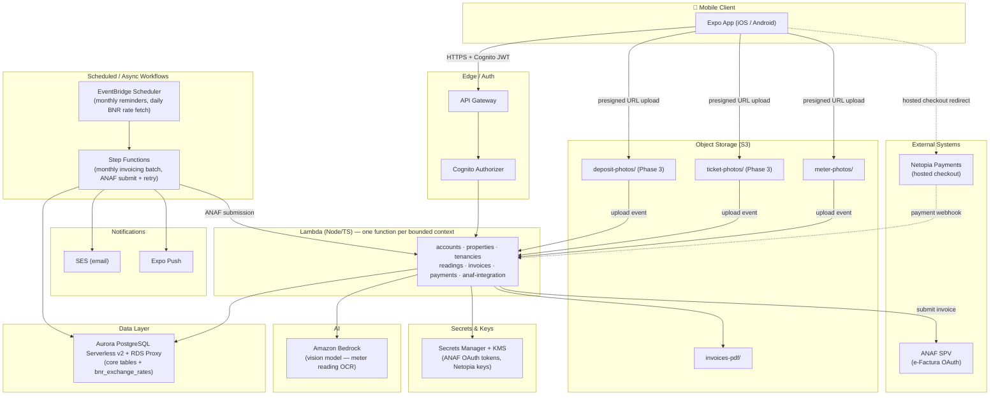

# SPEC.md — Landlord/Tenant Management Platform (B2B / B2C / C2B / C2C)

## 1. Purpose and context

An application for managing the landlord–tenant relationship (NOT a listing/booking marketplace). The landlord
creates a profile, adds their portfolio of properties/units and, once the rental relationship already exists
"in fact", invites the tenant into the app to submit monthly meter readings and receive invoices/statements.

Covers four types of contractual relationship on the same platform:

| Type | Description                                             | Invoicing                                  |
|------|------------------------------------------------------------|---------------------------------------------|
| B2B  | Landlord as a legal entity/sole trader (SRL or PFA) ↔ tenant as a company | Automatic, ANAF e-Factura (SPV OAuth) |
| B2C  | Landlord as a legal entity/sole trader (SRL or PFA) ↔ tenant as an individual | Automatic, ANAF e-Factura (SPV OAuth) |
| C2B  | Landlord as an individual ↔ tenant as a company             | Manual — "expense statement" showing the 8% withholding tax the tenant-company must retain (Section 4.10); ANAF contract registration (Form C168) is mandatory, not optional |
| C2C  | Individual ↔ individual, contract not registered with ANAF (registration optional) | Manual — "expense statement" + manual payment marking by the landlord |

These four labels are informal shorthand, not stored as their own value anywhere: whether a tenancy is
"B2B" vs "B2C" (or "C2B" vs "C2C") is entirely a function of whether the tenant is a company or an
individual (`tenancies.tenant_type`, Section 3.1) — the legal form of the `legal_entity` that owns the
unit (SRL vs PFA, both `REGISTERED_ANAF`-capable; see `legal_entities.type`, Section 3.1) doesn't change
e-Factura behavior at all, so it doesn't change the label either. A PFA renting to a company is B2B,
exactly like an SRL renting to a company. An owner can hold multiple `legal_entities` (e.g. renting one
unit as a Persoană Fizică and another — even in the same building — through an SRL) — the label is decided
per-unit, by whichever legal entity that unit belongs to, not by the owner's `account` as a whole.

### 1.1 Problem statement & value proposition (per contract type)

| Type | Problem without the platform | Value the platform adds |
|------|-------------------------------|---------------------------|
| **B2B** | e-Factura has been mandatory since July 2024, with real penalties for missing it: 1,000–10,000 lei for the issuer (by company size) for not transmitting within 5 calendar days, and — on the recipient side — a fine equal to the invoice's full VAT amount for booking an invoice that wasn't properly issued through RO e-Factura. None of that touches the actual bottleneck: the invoiced amount still has to be derived from metered consumption + rent, usually assembled in a spreadsheet before being re-keyed into separate invoicing software to generate the UBL/CII XML by hand. | Confirmed meter readings (Section 4.5) flow straight into the invoice computation (Section 4.6) and automatic e-Factura submission (Section 4.8) — one pipeline from "tenant photographs the meter" to "ANAF has a compliant invoice inside the 5-day window," with no manual re-entry step and no XML tooling to learn or penalty deadline to track by hand. |
| **B2C** | Same mandatory e-Factura + penalty exposure as B2B, compounded by a counterparty (an individual tenant) who's less likely to understand an e-Factura/SPV notification and more likely to dispute a charge informally (a text message) than through any documented channel — leaving the landlord as the sole point of contact for every question. | Same automated e-Factura pipeline, plus tenant self-service: photo-based reading submission, in-app invoice view, online payment (Netopia) — the landlord stops being the manual relay between "what's owed" and "how do I pay it." |
| **C2B** | A regime most owners and companies don't know applies to them (effective since 2024): mandatory Form C168 registration within 30 days of signing, plus an 8% withholding tax the tenant-company must calculate and file (D100 monthly, D205 annual). The calculation itself is a documented source of error: the 10% rate applies to 80% of gross rent (after a flat 20% deduction), not to the gross amount directly — applying 10% straight to the gross rent overcharges the withholding by 25% of the correct tax (e.g. 300 lei withheld instead of the correct 240 lei on a 3,000 lei rent), usually only caught when the owner questions why the net payment doesn't match expectations. | The withholding line (gross, tax withheld, net due) is computed correctly and automatically on every statement using the two-step 80%/10% calculation (Section 4.10), and the C168 registration requirement is tracked/reminded (Section 3.1, Section 4.4) instead of silently skipped — removes both the compliance-miss risk and the "why is this amount different from the contract" dispute. |
| **C2C** | No fiscal obligation, but also no tooling — and this is exactly the segment where documented rental disputes concentrate: proving what was actually paid when rent changes hands informally (cash, no receipt), and — a well-documented pain point independent of contract type — justifying a withheld security deposit at move-out, which legally requires concrete proof (contract, payment records, handover protocol, photos, message history), not just a claim from either side. | No fiscal automation to offer here, so the value is entirely operational: computed rent/utility amounts remove disputed math, photo-verified readings remove disputed consumption, and payment-status tracking (Section 4.7) builds exactly the kind of dated, documented history that a dispute — including a deposit dispute — needs to be resolved on evidence instead of on who argues harder. If the relationship is later formalized (Section 4.4), the full history transfers with zero re-entry. |

Across all four types, the common thread is a single computed source of truth for rent + utilities instead of
manual math re-derived by each party; **B2B/B2C/C2B** additionally get compliance automation (e-Factura,
withholding), while for **C2C** the entire case rests on removing friction and disputes, not compliance.

**Security deposit (`garanție`)**: a documented source of disputes across *all four* contract types (not just
C2C) — proving what condition the unit was in, and justifying any amount withheld at move-out, otherwise
rests on a claim from either side rather than evidence. Modeled in Section 3.1/Section 4.11 (Phase 3): the
deposit itself is never invoiced or taxed at collection (it's a liability held on the tenant's behalf, not
rental income — see Section 11), but a portion withheld to cover unpaid rent is reclassified as rent and
flows through the normal invoicing/withholding pipeline (Section 4.6/Section 4.10) once withheld.

## 2. Architecture decisions (summary)

| Domain                    | Decision                                                                  |
|-----------------------------|------------------------------------------------------------------------|
| Mobile                     | React Native + Expo (EAS Build / EAS Update for OTA)                     |
| Backend compute            | Serverless — AWS Lambda + API Gateway + Step Functions                   |
| Database                   | Amazon Aurora PostgreSQL Serverless v2 (+ RDS Proxy)                      |
| Authentication             | AWS Cognito (global identity) — roles/scope live in Postgres, not Cognito |
| AI meter reading            | Amazon Bedrock (vision model), invoked from Lambda                       |
| Online payments            | Netopia Payments (hosted checkout, no card data stored) — Apple Pay/Google Pay surface as wallet options within the same hosted checkout, no separate native integration |
| ANAF e-Factura              | Each Account connects its own SPV via OAuth (not a centralized certificate) |
| AWS region                  | eu-west-1 (Ireland)                                                       |
| Notifications               | Push (Expo) + Email (SES)                                                 |
| Delivery                     | Phased: narrow MVP → Phase 1 (AI + notifications) → Phase 2 (ANAF live) → Phase 3 (payments & extras) |
| Environments                | Single AWS account (eu-west-1); logical DEV/PROD isolation from v1 (separate resource sets + naming/tags, not separate accounts) — extra lower environments (e.g. staging) added the same way on demand |

## 3. Data model — Multi-tenancy and user hierarchy

Core idea: **identity (Cognito) is global and separate from authorization (roles/scope, in Postgres)**. A
person can be a landlord on one account and, at the same time, a tenant on another landlord's unit — with a
single login.

```
users (Cognito sub) ──┬── account_memberships ──> accounts ──> properties ──> units ──> unit_utilities
                       └── tenancy_memberships ──> tenancies ─────────────────────────────┘
```

### 3.1 Core entities

- **users** — `id (cognito_sub)`, `email`, `phone`, `name`. Holds no roles.
- **accounts** — the owner's workspace/portfolio container — collaborators (Section 4.2) and properties are
  scoped to this, but it carries no fiscal identity of its own anymore (see `legal_entities` below for why).
  `id`, `name` (defaults to the creating user's own name at signup, Section 4.1 — just a display label,
  renamable later, not a registered legal name), `created_by`.
- **legal_entities** — a fiscal identity an `account` can invoice/be invoiced under — a Persoană Fizică
  identity (CNP-based) or a specific registered business (PFA/II/IF/SRL/SA, CUI-based). One `account` can
  hold **multiple** `legal_entities` — e.g. an owner renting one unit under their own name and another
  through an SRL, or holding two separate SRLs for liability separation. Each `unit` (below) belongs to
  exactly one `legal_entity`, which is what actually decides that unit's e-Factura eligibility and
  contract-type options — not the `property` it's in, and not the `account` as a whole (Section 1's note
  above). A single building (`property`) can have units billed under *different* legal entities.
  `id`, `account_id`, `type [REGISTERED_INDIVIDUAL|REGISTERED_COMPANY|UNREGISTERED_INDIVIDUAL]`, `legal_name`,
  `cui_cnp` (**unique**), `vat_payer bool`, `invoice_series`, `invoice_next_number`, `anaf_oauth_status`.
  `cui_cnp` being unique is what makes the owner+collaborators model work: a CNP identifies exactly one
  person and a CUI exactly one company, so it's the real key tying an `account` together — the owner and
  every collaborator they invite (Section 4.2) sign up under their *own* email but all land on
  `account_membership` rows against the same `account`, found via a CUI/CNP that already backs one of that
  account's `legal_entities`.
  Named for fiscal registration status, deliberately *not* reusing the informal B2B/B2C/C2B/C2C shorthand
  above — that labels the *tenancy* (Section 1), and is a function of `tenancies.tenant_type`, completely
  independent of this field (a `REGISTERED_INDIVIDUAL` legal entity renting to a company is B2B, exactly like
  a `REGISTERED_COMPANY` one renting to a company — see Section 1's note). `type` gates which
  `tenancies.contract_type` values a unit under this legal entity can use: `REGISTERED_INDIVIDUAL` (PFA,
  II, or IF — the three sibling individual forms under OUG 44/2008, none with legal personality, all
  CUI-bearing, taxed the same way) and `REGISTERED_COMPANY` (SRL or SA, has a CUI — both map to the same
  `type`, distinguished only by `legal_name`) both issue e-Factura → `REGISTERED_ANAF` tenancies only.
  `UNREGISTERED_INDIVIDUAL` (a plain individual, no CUI, no PFA registration) can't issue e-Factura at all →
  only `C2B_WITHHOLDING` or `UNREGISTERED_C2C` tenancies (Section 1's C2B/C2C rows — "Landlord as an
  individual").
  **Collection timing differs by type** (Section 4.3): creating a `REGISTERED_INDIVIDUAL`/`REGISTERED_COMPANY`
  legal entity (i.e. picking a business legal form) collects `cui_cnp` (checksum-validated CUI), `legal_name`,
  `vat_payer`, and `invoice_series` **immediately**, at the point the owner is adding the first unit under
  it — a CUI isn't specially-protected personal data, and by that point creating the entity has no purpose
  without it. Creating an `UNREGISTERED_INDIVIDUAL` legal entity only collects a display name — `cui_cnp`
  (the person's CNP, specially-protected personal data under Legea 190/2018) stays `NULL` and is deferred to
  the entity's first `tenancy` (Section 4.4), same data-minimization rationale as before (Legea 190/2018
  art. 4 + GDPR Art. 5(1)(c)), just scoped to the `legal_entity` instead of the `account`.
- **account_memberships** — links a user to an account with a role.
  `id`, `account_id`, `user_id`, `role [OWNER|COLLABORATOR|ACCOUNTANT_READONLY]`.
  - `OWNER` → full implicit access, no scope needed.
  - `COLLABORATOR` / `ACCOUNTANT_READONLY` → access **only** to explicit scope (see below). No scope row
    means no access at all (not "full access by default").
- **account_membership_scopes** — `membership_id`, `property_id NULL`, `unit_id NULL`. One row per
  property/unit explicitly assigned to a collaborator.
- **properties** — just the building — an address container, nothing more. `id`, `account_id`,
  `street_number`, `street`, `address_line2 NULL` (bloc/scară/etaj/ap., optional), `postal_code`, `city`,
  `county`, `active bool` (default `true`) — deactivating hides a property, and every unit under it, from
  new-tenancy eligibility (Section 4.4) without deleting it; a genuine delete removes the row (and its
  units) outright. No `type` and no `legal_entity_id` here — both belong on `units` (below), since a single
  building can hold units of different types and different fiscal identities.
- **units** — the actual rentable/invoiceable thing. `id`, `property_id`, `legal_entity_id`, `label`,
  `type [APARTMENT|HOUSE|RETAIL|WAREHOUSE|OFFICE]`, `area_sqm`, `rooms`. `type` is asked here, not on the
  building — a mixed-use property (e.g. a building with `APARTMENT` units and a ground-floor `RETAIL`
  unit) is valid, and asking at property-creation time would be premature (the building itself has no
  inherent type, only what's built or subdivided inside it does).
- **unit_utilities** — utility configuration per unit (the toggles set when adding the property).
  `id`, `unit_id`, `utility_type [COLD_WATER|HOT_WATER|GAS|ELECTRICITY|INTERNET|TRASH|MAINTENANCE|OTHER]`,
  `enabled bool`, `tariff_basis [METER_INDEX|FIXED_COST|QUOTA_SHARE|PER_PERSON]`,
  `unit_price` (for METER_INDEX), `fixed_amount` (for FIXED_COST), `quota_percentage` (for QUOTA_SHARE),
  `sequence_order int` — the order used in the photo-capture wizard.
- **tenancies** — the rental contract on a unit.
  `id`, `unit_id`, `start_date`, `end_date`, `contract_type [REGISTERED_ANAF|C2B_WITHHOLDING|UNREGISTERED_C2C]`,
  `status`, `rent_amount`, `rent_currency [EUR|RON]` (base rent as negotiated — in Romania typically
  EUR-indexed even when invoiced in RON; kept flexible for contracts already denominated in RON),
  `anaf_c168_registered bool` (default `false`), `anaf_c168_registration_date NULL` — tracks whether the
  civil rental contract has been registered with ANAF (Form C168), independent of `contract_type`:
  **mandatory** for `C2B_WITHHOLDING` (owner is an individual, tenant is a company), **optional** for
  `UNREGISTERED_C2C`. Not applicable to `REGISTERED_ANAF` (B2B/B2C), where the owner already operates under
  a different fiscal regime (SRL/PFA) and e-Factura, not C168, is the relevant mechanism. The app only
  tracks that registration happened (a confirmation checkbox + date) — it does not submit Form C168 itself.
  Also `tenant_type [INDIVIDUAL|COMPANY]` — the fact that actually drives the informal B2B/C2B (`COMPANY`)
  vs B2C/C2C (`INDIVIDUAL`) label (Section 1), not `legal_entities.type`. Only when `tenant_type = COMPANY`:
  `tenant_company_name`, `tenant_company_cui` — the tenant-company's fiscal identity, needed to address
  the e-Factura (B2B) or to identify the paying company on the withholding statement (C2B); the individual
  linked via `tenancy_memberships` may just be an employee using the app on the company's behalf, not the
  fiscal entity itself. `association_code` (nullable, short alphanumeric) — generated when the owner creates
  the tenancy, cleared once a tenant links to it via self-registration (Section 4.4); replaces the older
  email/SMS-invite-only flow.
- **bnr_exchange_rates** — daily FX reference rates cached from BNR's public feed.
  `id`, `rate_date`, `currency (e.g. EUR)`, `rate_to_ron`. Populated by a scheduled job (see Section 4.6, Section 6); never
  fetched synchronously during invoice generation so the rate used is always reproducible/auditable.
- **tenancy_memberships** — links tenant users to a tenancy (global identity — a user can have
  tenancy_memberships on units belonging to different accounts/landlords).
  `id`, `tenancy_id`, `user_id`, `role [PRIMARY_TENANT|CO_TENANT]`, `invited_at`, `accepted_at`.
- **meter_readings** — a monthly reading for a `unit_utility` within a `tenancy`.
  `id`, `unit_utility_id`, `tenancy_id`, `period (YYYY-MM)`, `photo_s3_key`, `ai_extracted_value`,
  `ai_confidence`, `confirmed_value`, `confirmed_by_user_id`,
  `status [PENDING_AI|PENDING_CONFIRMATION|CONFIRMED|REJECTED]`.
- **invoices** — `id`, `legal_entity_id` (which fiscal identity issues it — determines `series`/numbering,
  not the `account` as a whole), `tenancy_id`, `period`, `invoice_type [AUTO_EFACTURA|MANUAL_DECONT]`,
  `series`, `number`, `vat_amount`, `total_amount`, `status [DRAFT|ISSUED|SENT_ANAF|PAID|OVERDUE]`,
  `anaf_upload_id`, `pdf_s3_key`.
- **invoice_lines** — `invoice_id`, `unit_utility_id NULL` (null for the rent line), `description`,
  `quantity`, `unit_price`, `amount`, plus — **only for the rent line** — `source_amount`,
  `source_currency`, `fx_rate_used`, `fx_rate_date` (kept for legal/audit traceability of the EUR→RON
  conversion actually applied), and — **only for the rent line on a `C2B_WITHHOLDING` tenancy** —
  `withholding_tax_rate` (fixed at the statutory 8% of gross rent — 10% applied to the 80% net taxable
  base), `withholding_tax_amount` (`amount × withholding_tax_rate`), `net_amount_due`
  (`amount - withholding_tax_amount`, the sum the tenant-company actually pays the landlord).
- **payments** — `invoice_id`, `amount`, `method [MANUAL|NETOPIA_CARD]`, `marked_by_user_id NULL`,
  `netopia_transaction_id NULL`, `paid_at`, `status`.
- **maintenance_tickets** — a defect/repair report raised by a tenant on their unit (Phase 3, Section 4.9).
  `id`, `tenancy_id`, `unit_id` (denormalized, as with `meter_readings`, for direct scope checks — see Section 3.2),
  `reported_by_user_id`, `title`, `description`, `status [OPEN|IN_PROGRESS|RESOLVED|CLOSED]`,
  `photo_s3_key NULL`, `created_at`, `resolved_at NULL`, `closed_at NULL`.
- **maintenance_ticket_comments** — a simple threaded exchange on a ticket between tenant and landlord.
  `id`, `ticket_id`, `author_user_id`, `message`, `created_at`.
- **deposits** — the security deposit (`garanție`) held on a `tenancy` (Phase 3, Section 4.11). `id`,
  `tenancy_id`, `amount`, `currency [EUR|RON]`, `status [HELD|RETAINED_RENT|RETAINED_DAMAGE|RETURNED]`,
  `payment_method [MANUAL|NETOPIA_CARD]`, `netopia_transaction_id NULL`, `paid_at`, `returned_at NULL`,
  `retained_amount NULL`, `retention_justification_s3_key NULL` (the handover protocol/`proces-verbal` or
  repair invoice/`deviz` backing a withheld amount). Never invoiced or taxed at collection (Section 11) — it's
  a liability held on the tenant's behalf, not rental income, until (and unless) retained.
- **deposit_condition_photos** — timestamped move-in/move-out photo evidence for a `deposit`, the basis for
  justifying (or disputing) a withheld amount. `id`, `deposit_id`, `phase [MOVE_IN|MOVE_OUT]`, `photo_s3_key`,
  `uploaded_by_user_id`, `uploaded_at`.

### 3.2 Permission resolution (on every request)

1. Cognito JWT → `user_id`.
2. Middleware/authorizer loads from Postgres: the user's `account_memberships` (+ scopes) and
   `tenancy_memberships`.
3. Per-endpoint check:
   - Account/property/unit routes: `role=OWNER` on the account → access granted; `role=COLLABORATOR` →
     access only if the requested `property_id`/`unit_id` appears in one of their
     `account_membership_scopes`.
   - Tenancy/reading/my-invoice/ticket/deposit routes: access granted if an active `tenancy_membership`
     exists for that `tenancy_id`; on the owner side, the same rule as account/property/unit routes applies
     (via the tenancy's `unit_id`, denormalized on tickets the same way).
4. A user can have 0..N `account_memberships` + 0..N `tenancy_memberships` at the same time → the mobile app
   has an **account/context switcher** in the UI.

## 4. Key flows

### 4.1 Landlord & tenant onboarding
Cognito sign-up (email/password + email confirmation code) is just a role choice — Proprietar (landlord) or
Chiriaș (tenant) — plus the person's own name (`users.name`, Nume + Prenume). That's the entire form: no
legal form, no association code, and no fiscal data (CUI/CNP, `legal_name`, `vat_payer`, `invoice_series`) is
collected at signup for either role — none of it is needed yet, and Legea 190/2018 art. 4 plus GDPR data
minimization (Art. 5(1)(c)) argue against gathering it speculatively. **The legal-form question moves out of
signup entirely for both roles**: for Proprietar it's asked per `legal_entity`, when adding a unit that
needs one (§4.3); for Chiriaș it's asked per `tenancy`, when linking one (§4.4) — a person acting through
different legal forms in different contexts (e.g. renting their own apartment as themselves, but linking a
company-leased office as a Chiriaș for their employer) was exactly the reasoning that made a single
signup-time choice wrong in the first place.

For Proprietar: Cognito sign-up → create `accounts(name)` (name defaults to the person's own name, just a
workspace label — renamable later, not a registered legal name) + `account_membership(role=OWNER)`. No
`legal_entity` is created at signup — the account starts with zero, and the first one gets created the first
time it's needed (§4.3). For Chiriaș: the same role+name form only feeds `users.name` — a tenant has no
`account` at all, so nothing else is created at sign-up; a `tenancy_membership` comes later, from linking a
tenancy (§4.4).

If the person already has an identity (e.g. an existing `tenancy_membership` as a tenant elsewhere — global
identity, Section 3), no new Cognito sign-up happens: "Become a landlord" from within the app shows the same
minimal form, then creates a new `account` + `account_membership(role=OWNER)` on their existing `user_id`.
Their existing `tenancy_membership`(s) are untouched — the header context toggle (Section 5.1) now shows
both contexts.

### 4.2 Adding a collaborator
Owner invites by email → Cognito (`AdminCreateUser` or an acceptance link if the user already exists) →
`account_membership(role=COLLABORATOR)` → UI for scope assignment (selecting properties/units).

Because `legal_entities.cui_cnp` is unique (Section 3.1), entering a CUI or CNP that already backs a
`legal_entity` isn't allowed to silently create a duplicate under a different `account`: it's rejected and the
person is pointed at asking the existing account's owner for a collaborator invite instead. For a business
legal form this check fires when creating the `legal_entity` itself (§4.3, at unit-add time); for a
Persoană Fizică legal entity, the CNP isn't collected until first-tenancy time (§4.4), so the check fires
there instead.

### 4.3 Adding a property + unit
Owner creates a `property` — just a building, structured address only (`street_number`, `street`,
`address_line2` optional, `postal_code`, `city`, `county` — not a single free-text field) — then adds one
or more `unit`s to it. Each `unit` is where the real decisions happen: its type (Apartament / Casă —
locativ; Spațiu comercial / Halà-depozit / Birou — comercial) and which `legal_entity` it's billed under
(Section 3.1 — a single building can hold units of different types *and* different legal entities). Then:
toggle list of utilities (cold/hot water, gas, electricity, internet, trash, maintenance) → for each active
utility: tariff basis (index / fixed cost / quota share / per person) + unit price/fixed amount/percentage +
**order in the photo-capture sequence**.

**Why type and legal entity live on the unit, not the building**: a property, by itself, has no inherent
type — it's just an address; asking "locativ sau comercial?" before any unit exists inside it would be
premature (and wrong for a mixed-use building). Same for the legal entity: since one account can hold
multiple `legal_entities` (Section 3.1), and a single building can genuinely have units invoiced under
different ones (e.g. one apartment as a Persoană Fizică, another through an SRL), the entity has to be a
per-unit choice, not a per-building one.

**Choosing/creating the legal entity (picked at unit-add time, but managed — created/edited/deleted —
from Settings, §5.1, not from inside this flow)**: if the account already has one or more `legal_entities`,
the owner picks one from a list when adding a unit; with zero, adding a unit is gated — the trigger is
inert until at least one `legal_entity` exists (created from Settings). Creating a `legal_entity` asks the
same legal-form picker signup used to ask (Persoană Fizică / PFA / Întreprindere Individuală / Întreprindere
Familială / SRL / SA) plus a name. **What's collected next depends on the choice** (Section 3.1's
collection-timing note): a business form (PFA/II/IF/SRL/SA) additionally requires CUI (checksum-validated,
rejected as a duplicate per §4.2's rule above), confirmed `legal_name`, an explicit `vat_payer` Da/Nu choice
(no silent default — same reasoning as the original per-account toggle), and `invoice_series` — all of it
right away, since a CUI-bearing entity has no purpose without its CUI. Persoană Fizică only asks for a name
— the CNP stays deferred to the entity's first `tenancy` (§4.4).

**Property lifecycle**: a property can be **deactivated** (`active = false` — hides it and its units
from new-tenancy eligibility, §4.4, without losing the record) or **deleted** outright (removes it and
its units, with confirmation). A unit can also be deleted individually (confirmation, warns if it's
currently rented), and so can a legal entity (confirmation, warns how many units currently reference it
— deleting doesn't cascade-delete those units, they're left pointing at a removed entity, same as any
other client-side mock with no backend integrity constraint). Properties, units, and legal entities are
all editable after creation (address fields; label/type/legal entity; name/CUI/VAT/invoice series
respectively) — **saving an edit (not a fresh add) always asks for confirmation first**, for the
inevitable typo caught after the fact.

*Implementation status*: `OwnerPortfolioScreen` (mobile, Portofoliu tab) does a minimal slice of this —
**properties only now**: add/edit properties (structured address only, with delete/deactivate) and, under
each, add/edit/delete units (label + type + legal entity, highlighted in its list while being edited).
Legal entities themselves are **not** managed here at all — see `OwnerSettingsScreen` (§5.1, Setări tab)
for that; this screen only reads `legalEntities` from `portfolioStore` to populate the unit form's picker.
**No filtering of the property list** — an earlier attempt at "Tip"/legal-entity filter chips (and, later,
a persistent cross-tab legal-entity header with its own select/collapse filter) was removed each time:
filtering by legal entity hid a just-added property outright (it has no units yet, so it matched nothing),
which read as a bug, not a feature; the persistent header also added complexity nobody wanted and squeezed
the tab content below it. No utility toggles yet, no `area_sqm`/`rooms` yet. It's a
separate screen from tenancy creation (§4.4) — a unit can exist here unrented indefinitely;
`OwnerTenanciesScreen` picks from units on **active** properties added here rather than creating one
inline — eligible units are grouped under their property (address header, then a shared bordered box
with hairline-divided rows per unit, same nesting Portofoliu itself uses for properties→units — this
reverted from an earlier "each unit its own tile" version). Two-option pickers (unit type
Locativă/Comercială, currency EUR/RON, Plătitor de TVA Da/Nu) all use a shared `Toggle` component
(`src/components/Toggle.tsx`, a merged segmented control) instead of two separately-bordered choice
boxes. Every add/edit form's action row (Adaugă/Salvează, Anulează, Șterge) is rendered as plain text
links (blue/grey-bold/red) rather than a filled primary button + separate cancel link — one consistent
button language across Proprietăți, Entități legale, and Chirii; the auth screens and the tenant's
association-code entry keep their filled primary-CTA button, since those are single-action screens with
no adjacent Anulează. The utility-configuration UI above is still unbuilt. Neither screen repeats its
tab name as an in-content title (Portofoliu/Închirieri) — AppStack's header already shows it — but each
CRUD screen now has a hairline divider + a "X existente" sub-heading (Proprietăți existente/Entități
legale existente/Chirii existente) separating the add-new area from the list of already-created items.
`OwnerTenanciesScreen`'s creation form is a centered dashed "+ Adaugă chirie" trigger (same
expand/collapse pattern as Portofoliu's "+ Adaugă proprietate" and Setări's "+ Adaugă entitate
legală") rather than always-visible, and its result/empty states use "chirie" throughout instead of
the earlier English "tenancy" wording. **Created tenancies persist as their own tiles** —
`portfolioStore`'s `tenancies`/`addTenancy`/`updateTenancy` (previously the created tenancy and its
`association_code` only flashed on a one-off "result" screen and were gone for good once you
navigated away or created another; `addTenancy` now both stores the `Tenancy` and flips the unit out
of the available pool in one update). Each tile shows "{unit label} · {sub-type}" (same format as
Portofoliu's own unit rows, via a shared `unitTypeLabel()` helper in `portfolioStore.ts`), "Cost chirie
(lunar): {amount} {currency} · din {start date}", and "Cod de asociere: {code}" with a **Copiază**
button (`expo-clipboard`, brief "Copiat ✓" feedback) — the code and its explanation ("Acest cod trebuie
transmis chiriașului pentru adăugarea unității în aplicația acestuia.") are always accessible, not a
one-time reveal. The start date field uses the RO date convention **ZZ-LL-AAAA**, not ISO. Tapping a
tenancy highlights just its own row; the edit form (start date/rent/currency, confirm-before-save)
renders once below the whole tenancy list for that property group — not nested inside the selected
row — same "form at the bottom of the list" pattern the unit-picker above already uses, adopted here
after an early version nested the form in the row and made the row+form read as one solid blue block.
**Tenancies can now be deleted** too (Șterge, inside the edit form, confirm Alert) — deleting one
resets the unit's `hasActiveTenancy` back to `false`, so it re-enters the available-units pool for a
new tenancy, same cascade `deleteProperty`/`deleteUnit` already do.

Each tile also shows an **Asociat/Neasociat** badge (green/amber) — same capitalized-first-word
convention as Portofoliu's own **Închiriată/Liberă** badge (grey/green), kept consistent across both
even though the color pairs differ — a *different* fact from the unit's own Închiriată/Liberă: whether the tenant
has actually entered the `association_code` in their own dashboard yet, not whether a tenancy
contract exists at all. A unit reads "Închiriată" the moment the owner creates the tenancy, but its
tenancy stays "Neasociat" until the tenant claims it. This loop is real in the mock, not simulated —
Owner and Tenant contexts share the same client-side `portfolioStore`
(`associateTenancyByCode`, called from `TenantTenanciesScreen`), so entering a valid code there
actually flips `tenancy.associated` and the owner sees it update. An unrecognized or already-used
code shows an inline error instead of silently "succeeding" the way the old mock did.

### 4.4 Associating a tenant & tenancy
Both directions start from *inside* the app (mobile, not at sign-up — §4.1 no longer asks for any code):

- **Owner**: from the Tenancies tab, picks an unrented `unit` from their Portfolio (§4.3) and adds a tenancy
  on it. The app generates a short `association_code` instead of sending an email/SMS invite, shown to the
  owner to pass along however they like.
- **Tenant**: from the Tenancies tab, enters that code. If they don't have an identity yet, they hit the
  minimal Cognito sign-up form first (§4.1, role = Chiriaș) — same "existing identity" pattern as "Become a
  landlord" applies if they already do (no new Cognito sign-up, just a new `tenancy_membership` on their
  existing `user_id`).

*Implementation status*: `OwnerTenanciesScreen`/`TenantTenanciesScreen` (mobile) exercise the code
generation + entry mechanics end-to-end (client-side only — no backend to actually resolve a code to a
tenancy yet, matches §4.1's TODO pattern). If the owner's Portfolio has no unrented unit, the "+ Adaugă
chirie" trigger just renders greyed-out/disabled with explanatory hint text (distinguishing "no units
in the portfolio at all" from "units exist but all are already rented") — it no longer auto-navigates
to Portofoliu on tap; property/unit creation lives only in §4.3, reached by the owner switching tabs
themselves. **The bilateral fiscal-collection step below is not built yet** — next up.

**Fiscal data is collected bilaterally right here, once the code resolves — this is the first point any of
it is actually needed for the tenant side (owner side may already be done, see below), per §4.1's
data-minimization rationale:**

- **Tenant side**: the same legal-form picker §4.1 used to ask — no signup default to fall back on anymore
  (§4.1), so it's picked fresh every time, confirmable/changeable per tenancy (a tenant linking a *second*
  tenancy might be acting on a *different* company's behalf than their first). Persoană Fizică →
  `tenant_type = INDIVIDUAL`, no other field (`tenancies` has no per-tenant CNP anywhere in the schema — see
  Section 3.1 for why). Any other choice → `tenant_type = COMPANY` + `tenant_company_name`/
  `tenant_company_cui` (checksum-validated CUI). Those two fields live on the `tenancy`, not the user, which
  is exactly why a second tenancy re-enters them. Unlike `legal_entities.cui_cnp`, `tenancies.tenant_company_cui`
  is **not** unique — the same company can legitimately rent multiple units, or the tenancy might be entered
  by an employee acting on the company's behalf without owning the CUI.
- **Owner side**: for a business `legal_entity` (PFA/II/IF/SRL/SA), `cui_cnp`/`legal_name`/`vat_payer`/
  `invoice_series` were already collected when that legal entity was created (§4.3, at unit-add time) —
  nothing to ask here. For a Persoană Fizică `legal_entity`, this is the first genuine trigger to collect its
  `cui_cnp` (the CNP) — only asked if still `NULL` (i.e. this is that legal entity's first tenancy).
  Either way it's **per-`legal_entity`, asked at most once** — a second tenancy under the same legal entity
  never asks again, but a tenancy under a *different* legal entity on the same account might, if that one's
  fiscal data isn't filled in yet.
- `contract_type` (`REGISTERED_ANAF`/`C2B_WITHHOLDING`/`UNREGISTERED_C2C`) is then derived automatically
  from the resulting `legal_entities.type` (of the tenancy's unit's legal entity — directly, since the
  legal entity is a unit-level field, Section 3.1) × `tenant_type` combination — the app never asks "is
  this B2B/B2C/C2B/C2C?" as a literal question (Section 1's note: those labels aren't stored as their own
  value anywhere).

`tenancy_membership` is created once all of the above resolves; `association_code` is cleared on the
`tenancy` once claimed.

If `contract_type = C2B_WITHHOLDING`, the owner is shown a reminder that registering the contract with ANAF
(Form C168, within 30 days of signing) is a legal requirement, not optional — the owner self-confirms once
done (`anaf_c168_registered = true`, `anaf_c168_registration_date`). For `UNREGISTERED_C2C`, the same
reminder is shown but framed as optional. The app never submits Form C168 itself (see Section 3.1).

### 4.5 Monthly meter reading (mobile wizard)
1. EventBridge Scheduler triggers a reminder (push + email) on a configurable day of the month.
2. The tenant opens the wizard → is shown the unit's active utilities **in `sequence_order`**.
3. Step by step: photograph the current meter → upload directly to S3 (presigned URL, `meter-photos` bucket)
   → Lambda invokes Bedrock (vision) with a prompt specific to the utility type → extracts value + confidence.
4. The tenant confirms/corrects the read value → `meter_reading.status = CONFIRMED` → moves to the next step
   in the sequence.

### 4.6 Invoice generation (monthly, Step Functions)
For each `legal_entity` (invoice series/numbering and ANAF OAuth are per-legal-entity, not per-account — an
account with multiple legal entities runs this independently for each), at the end of the billing cycle:
1. Collect the period's confirmed `meter_readings` for each `tenancy`.
2. **Rent line**: if `tenancy.rent_currency = EUR`, look up `bnr_exchange_rates` for the last published rate
   dated strictly before the invoice issuance date (skips weekends/bank holidays — BNR does not publish on
   non-business days, so this resolves to "last available rate before invoice date", which is the standard
   fiscal reading of "the day before" in Romanian tax practice) → `rent_amount_RON = rent_amount × rate`.
   The `source_amount`, `source_currency`, `fx_rate_used`, `fx_rate_date` are stored on the invoice line for
   audit purposes. If `rent_currency = RON`, no conversion — the line is just `rent_amount`.
3. **Utility lines** (always computed directly in RON, no FX involved): index → `(current - previous) ×
   unit_price`; fixed → `fixed_amount`; quota → `shared_meter_total × quota_percentage`; per person →
   `cost × number_of_occupants`.
4. If `tenancy.contract_type = REGISTERED_ANAF` (B2B/B2C): generate UBL/CII XML, submit to ANAF via the
   issuing legal entity's OAuth token (SPV), store `anaf_upload_id`, generate a PDF, `status = SENT_ANAF`.
5. If `contract_type = UNREGISTERED_C2C`: generate only an "expense statement" PDF (no ANAF submission),
   `status = ISSUED`, awaiting manual payment marking by the landlord.

**BNR rate ingestion**: a daily scheduled Lambda (EventBridge, early morning on business days) fetches BNR's
public reference-rate feed (XML) and upserts into `bnr_exchange_rates`. Because it runs before the monthly
invoicing batch, the previous business day's rate is always already cached — the invoicing Step Function
never calls BNR synchronously.

### 4.7 Payment
- Manual: owner marks the `invoice` as paid → `payment(method=MANUAL, marked_by_user_id)`.
- Online (Netopia): the tenant pays via hosted checkout → Netopia webhook → `payment(method=NETOPIA_CARD)`
  → `invoice.status = PAID`. The application never stores card data (minimal PCI scope, SAQ-A).

### 4.8 Connecting ANAF SPV (per legal entity)
Settings → pick a `legal_entity` → "Connect ANAF" → redirect to the SPV authorize endpoint → callback Lambda
exchanges the `code` for an `access_token`/`refresh_token` → encrypted storage (Secrets Manager /
KMS-encrypted column) → scheduled Lambda refreshes the token before expiry. An account with multiple
CUI-bearing legal entities connects each separately — ANAF SPV access is granted per-CUI, not per-account.

### 4.9 Maintenance ticket lifecycle (Phase 3)
1. Tenant opens "Report an issue" on a `tenancy` → title + description + optional photo (same presigned-S3
   upload pattern as meter photos, Section 4.5, into the `ticket-photos` bucket, including offline-first
   capture per Section 5.3) →
   `maintenance_ticket.status = OPEN`.
2. Owner (or a collaborator scoped to that property/unit, Section 3.2) is notified push+email (Section 5.4) of
   the new ticket.
3. Owner sets `status = IN_PROGRESS` once work starts, optionally adding a `maintenance_ticket_comment`
   (e.g. "plumber scheduled Tuesday") → tenant is notified of the status change.
4. Owner sets `status = RESOLVED` once the repair is done → tenant is notified; the tenant can either confirm
   (no action needed) or reopen (`status → OPEN`) via a comment if the issue persists.
5. Owner sets `status = CLOSED` after resolution is confirmed. The full `maintenance_ticket_comments` thread
   stays attached to the ticket as a record of the exchange.

### 4.10 C2B rent statement & withholding tax (Phase 0)
For a `C2B_WITHHOLDING` tenancy (individual landlord, company tenant), at the end of the billing cycle:
1. Same rent + utility line computation as Section 4.6 (including EUR→RON conversion if `rent_currency = EUR`).
2. On the rent line, the app additionally computes `withholding_tax_amount = amount × 8%` (the statutory
   rate — 10% applied to the 80% net taxable base after the flat-rate deduction) and
   `net_amount_due = amount − withholding_tax_amount`.
3. Generates an "expense statement" PDF (same as `UNREGISTERED_C2C`, **no** e-Factura/ANAF submission — the
   landlord isn't a taxable person with a CUI) that clearly itemizes gross rent, the withholding tax amount,
   and the net amount due, so the tenant-company has what it needs for its own D100 (monthly, code 628)
   and D205 (annual) filings.
4. `status = ISSUED`, awaiting manual payment marking by the landlord (Section 4.7) — same as C2C, since the
   tenant here is a company without a Netopia consumer checkout flow.

The app computes the withholding line for the landlord's/tenant's visibility only. Filing D100/D205 (the
tenant-company's obligation) and, for the landlord, any Declarația Unică (D212) + CASS obligations on other
income are out of scope, consistent with the fiscal accounting/reporting scope decision in Section 11.

### 4.11 Security deposit lifecycle (Phase 3)
1. At tenancy start, the owner sets the `deposit.amount` (typically 1–2 months' rent, freely negotiated — no
   statutory cap) → the tenant pays it via the same Netopia hosted checkout used for invoices (Section 4.7),
   which already surfaces Apple Pay/Google Pay as wallet options with no separate native integration, or the
   owner marks it paid manually (cash) → `deposit.status = HELD`. **No invoice or e-Factura line is
   generated** — the deposit is a liability, not rental income (Section 3.1). On collection, the owner is
   shown an in-app note **and** sent a push/email notification (Section 5.4): *"This is a refundable
   deposit, not income — don't report it as rental revenue. If you keep double-entry books, record it under
   462 'Creditori diverși' (liability), not a revenue account (704/706)."* Same inform-don't-file pattern as
   the Section 4.4 C168 reminder — the app names the correct account, it doesn't post the entry.
2. Move-in: both parties (or just the owner) upload dated condition photos (`deposit_condition_photos`,
   `phase = MOVE_IN`) — same presigned-S3 upload pattern as meter photos (Section 4.5), into the
   `deposit-photos` bucket.
3. At tenancy end, the same flow runs for `phase = MOVE_OUT` — move-in and move-out photos sit side by side
   as the evidentiary basis for any retention decision.
4. Owner decides: **return** (`status = RETURNED`, `returned_at` set, full amount paid back — no document
   needed beyond the payment proof) or **retain** (partial or full):
   - `RETAINED_DAMAGE`: `retained_amount` set, backed by an uploaded `retention_justification_s3_key`
     (repair invoice/`deviz` or handover protocol) — treated as damage compensation, not rental income
     (Section 11) — no further invoicing/withholding action needed.
   - `RETAINED_RENT`: `retained_amount` set, justification documents the unpaid period — that amount is
     **not** left inside `deposits`; it's pushed into the normal billing pipeline as an additional invoice
     line (Section 4.6) or, for `C2B_WITHHOLDING` tenancies, run through the withholding calculation
     (Section 4.10), since it now functions as rent actually received.
5. Any undisputed remainder (deposit minus retained amount) is returned the same way as a full return.

## 5. Mobile application structure

Single Expo/React Native codebase for iOS + Android. Because identity is global (Section 3), the same install of
the app serves a user acting as landlord, collaborator, and/or tenant — the navigation structure and screen
set are role-driven at runtime, not separate apps.

### 5.1 Navigation structure

```
RootNavigator
├── AuthStack (unauthenticated)
│   ├── SignIn / SignUp
│   └── InviteAcceptance (deep link from an email/SMS invite → binds to an
│       existing account_membership or tenancy_membership)
│
└── AppStack (authenticated — Cognito session present)
    │   Single header, shared by both tab sets below: a compact Proprietar/Chiriaș dropdown chip
    │   (headerLeft, not a separate screen) — always shows both, even if the user only has one
    │   context; tapping the one they have switches the tabs below (no navigation/push involved),
    │   tapping the one they don't prompts to activate it ("Become a landlord" / link a tenancy via
    │   association code — §4.1/§4.4). Center title tracks whichever tab is currently focused.
    │
    ├── OwnerTabs (visible when the active context is an account_membership) — 5 self-contained tabs,
    │   │ kept at the usual bottom-bar limit; Collaborators (§4.2: invite, assign property/unit scope)
    │   │ isn't its own tab, it folds into Settings (an administrative action, same category as fiscal
    │   │ data/ANAF/Netopia config). No persistent cross-tab header above them — an earlier
    │   │ `LegalEntityHeader` tried that (legal entities added/edited/deleted from a bar shown on all
    │   │ 5 tabs, with a select-to-collapse "filter" and a small ▾ arrow to get back to the full
    │   │ list) and was removed: extra complexity nobody wanted, plus real risk of squeezing the
    │   │ Tab.Navigator's own layout (it caused a blank-screen bug once). Legal entities now live only
    │   │ in Settings, a normal tab screen like any other.
    │   ├── Portfolio (properties (buildings) → units, add/edit, utility toggles + tariff config —
    │   │   §4.3; properties only — each unit picks its own type and legal entity, not the building,
    │   │   and legal entities themselves are managed from Settings, not from this screen)
    │   ├── Tenancies (pick an unrented unit from Portfolio, create tenancy, invite tenant, contract
    │   │   type; per-tenancy deposit collection, move-in/move-out photos, retain/return decision —
    │   │   Section 4.11, Phase 3)
    │   ├── Invoices (list, status, ANAF submission state, mark-paid action)
    │   ├── Maintenance (ticket list per unit, status updates, comment thread — Section 4.9, Phase 3)
    │   └── Settings — `OwnerSettingsScreen`: add/edit/delete legal entities, each its own tile (same
    │       visual language as Portofoliu's property tiles — a separate bordered card per entity, not
    │       one shared box with divided rows). Editing happens **in place, in that same tile** (same
    │       pattern as units in Portofoliu) — tapping Editează turns that entity's own card into the
    │       form, rather than opening a detached form elsewhere on the screen; a new entity still adds
    │       via the trigger at the top, since there's no existing tile to expand in place for one.
    │       Business forms collect CUI/VAT/invoice series right away, duplicate CUI against another of
    │       the account's own legal entities rejected inline; Persoană Fizică just a name, CNP deferred
    │       to first tenancy (§4.4). Plus (not yet built)
    │       per-legal-entity invoice series/VAT/ANAF connect, Netopia config, Collaborators
    │
    └── TenantTabs (visible when the active context is a tenancy_membership)
        ├── MyTenancies (units rented, possibly across different landlords; per-tenancy deposit status,
        │   move-in/move-out photo upload — Section 4.11, Phase 3)
        ├── ReadingWizard (per Section 4.5 — step-by-step camera capture, sequence_order-driven)
        ├── MyInvoices (view, pay online via Netopia hosted checkout, view receipt)
        ├── Maintenance (report an issue, view ticket status/comments — Section 4.9, Phase 3)
        └── Notifications (reminders, invoice issued, payment confirmations)
```

A user with both an `account_membership` and a `tenancy_membership` sees both `OwnerTabs` and `TenantTabs`
as separate contexts reachable via the header toggle — never merged into one screen, to keep the mental
model (and the authorization scope of every screen) unambiguous. Which context(s) a user has is inherited
from what they picked at sign-up (§4.1) by default, plus whichever they activate afterward (e.g. "Become a
landlord", or linking a tenancy via an association code — §4.4) — both extend the set, neither replaces it.

### 5.2 State management & data layer

- **Server state**: TanStack Query (React Query) for all API data — caching, retries, background refetch;
  matches the Lambda/REST backend directly, no bespoke client-side store duplicating server state.
- **Local/UI state**: React Context + `zustand` for cross-screen UI state that isn't server data (active
  context/account selection, in-progress wizard step).
- **Auth/session**: Cognito tokens (access/refresh) in `expo-secure-store` (Keychain/Keystore-backed, never
  AsyncStorage) — refreshed transparently by the API client on 401.
- **Offline reading capture (per decision below)**: a local SQLite queue (`expo-sqlite`) — see Section 5.3.

### 5.3 Offline-first meter reading capture

Meter cupboards/basements often have poor or no signal, so the reading wizard **must not depend on a live
connection at capture time**:

1. Photo is taken and immediately written to local device storage + a row in a local SQLite `upload_queue`
   table (`unit_utility_id`, `period`, `local_file_uri`, `status: PENDING_UPLOAD`).
2. The wizard advances to the next meter in `sequence_order` immediately — it never blocks on network I/O.
3. A background sync task (foreground task on app resume + `expo-background-fetch` opportunistically)
   drains the queue: requests a presigned S3 URL per pending item, uploads, then marks the row `UPLOADED`
   and triggers the existing upload-event → Bedrock flow (Section 4.5) server-side.
4. AI-extracted values/confidence are pulled back into the app (poll or push) once processed, so the tenant
   can confirm/correct — this confirmation step can itself happen later/offline-first too, with the
   confirmed value queued the same way if still offline.
5. Failure handling: exponential backoff per queue item; the queue survives app restarts/kills (SQLite, not
   in-memory); a visible "N readings pending upload" indicator avoids silent data loss.

### 5.4 Push notifications & deep linking

Expo push token registered post-login, stored server-side against the `user_id` (fan-out target is whichever
context — account or tenancy — the notification concerns). Notifications deep-link directly into the
relevant screen (e.g. a reading reminder opens `ReadingWizard` pre-scoped to that tenancy/period).

### 5.5 Testing & release

- **E2E**: Maestro (camera/upload flows are the highest-risk regression surface — Maestro's device-farm
  friendly, YAML-based flows fit this better than Detox for a small team).
- **EAS Build profiles** mirror the backend environments (Section 8): `development` (dev API, sandbox ANAF/Netopia,
  dev client), `preview` (internal QA builds against `prod`-like staging if/when added), `production` (store
  builds, live API). **EAS Update** channels map 1:1 to these profiles for OTA JS/asset updates without an
  app-store review cycle.

## 6. AWS architecture



AWS services used: Cognito, API Gateway, Lambda, Aurora Serverless v2, RDS Proxy, S3, Bedrock,
Step Functions, EventBridge Scheduler, SES, Secrets Manager, KMS, CloudWatch, X-Ray, WAF.

## 7. Repository structure & tooling

Monorepo containing the mobile app, backend services, shared domain code, and infrastructure:

```
helix-core/
├── apps/
│   └── mobile/              # Expo/React Native app (Section 5)
├── services/
│   └── <name>/              # one Lambda per bounded context (Section 6): accounts, properties, tenancies,
│                            # readings, invoices, payments, anaf-integration, bnr-rates
├── packages/
│   └── domain/              # shared TS types, Zod schemas, Drizzle schema, tariff/FX calculation logic —
│                            # imported by services/invoices and apps/mobile (e.g. bill preview)
├── infra/                   # Terraform (Section 8) — separate tool chain, sibling directory only, not part of
│                            # the JS/TS workspace graph
└── SPEC.md
```

### 7.1 Package manager & task orchestration
- **pnpm workspaces**: internal packages reference each other via `workspace:*` (e.g. `services/invoices`
  depends on `packages/domain`), resolved as local symlinks — no publishing to a registry needed.
- **Turborepo** orchestrates build/test/lint across packages: derives the dependency graph from `workspace:*`
  references, runs tasks in the correct order, and caches per-package outputs (only what changed, and its
  dependents, is rebuilt/retested).
- **Expo/Metro**: as of Expo SDK 52+ (currently on SDK 57), Metro auto-detects the monorepo and resolves
  pnpm's symlinked `node_modules` on its own via `expo/metro-config` — **no custom `metro.config.js`**.
  Earlier SDKs needed manual `watchFolders`/`resolver.nodeModulesPaths` config; that's now actively wrong
  to add (the official guide says to delete it if migrating from an older setup).

### 7.2 Database access layer
- **Drizzle ORM** for Aurora Postgres access from Lambda: schema (tables, enums, relations — Section 3.1) defined
  once in `packages/domain`, consumed as typed queries by every service that needs DB access.
- Chosen over Prisma for lower cold-start overhead (no separate query-engine binary to load per invocation)
  and over raw SQL + hand-rolled migrations for compile-time type safety, while keeping generated queries
  close to plain SQL.

## 8. Terraform — modular structure & environment strategy

**Single AWS account** (eu-west-1) hosts every environment. DEV/PROD isolation is **logical, not
account-level**:

- Every environment-scoped resource is namespaced by prefix (`helix-dev-*`, `helix-prod-*`) — needed anyway
  for globally-unique names (S3 buckets, Cognito domain).
- Separate resource instances per environment: own Cognito User Pool, own Aurora Serverless v2
  cluster/database, own S3 buckets, own API Gateway stage + Lambda aliases, own Step Functions state machines,
  own VPC.
- Terraform: one `environments/<env>/` folder per environment, each with its own `.tfvars` and its own remote
  state path (separate S3 state key, S3-native lockfile locking — Terraform ≥ 1.10, no DynamoDB) — same
  backend account/bucket, different state path per environment, so an `apply` in dev can never touch prod
  state.
- IAM: policies/conditions scoped by naming convention/tags (`Environment = dev|prod`) so that, even within
  the same account, a dev-scoped Lambda role cannot read/write prod-tagged resources (enforced via S3 bucket
  policies, KMS key policies, Secrets Manager resource policies).
- Secrets (ANAF OAuth client credentials, Netopia API keys) are stored per environment in Secrets Manager
  under an environment-prefixed path (`/dev/anaf/...`, `/prod/anaf/...`) — pointing at ANAF's SPV **sandbox**
  and Netopia's **sandbox** keys in dev, and the live endpoints/keys in prod.
- Extra lower environments (e.g. `staging`) follow the exact same pattern — just another
  `environments/staging/` folder and another tag value; no architectural change required.

```
infra/
  bootstrap/         # one-time, manually-applied, local-state config: creates the S3 state bucket every
                     # environment's backend points at (chicken-and-egg — it can't use the backend it
                     # creates). Run once per AWS account before any environment can `terraform init`.
  modules/
    network/        # VPC, private subnets (Aurora + Lambda ENI), NAT — one VPC per environment, same account
    database/       # Aurora Serverless v2, RDS Proxy, Secrets Manager (DB creds)
    auth/            # Cognito User Pool + App Clients (one pool per environment)
    storage/         # S3: meter-photos (lifecycle), invoices-pdf, ticket-photos, deposit-photos (Phase 3,
                     # own lifecycle — deposit-photos retained longer, tied to move-out disputes) — all
                     # env-prefixed bucket names
    api/             # API Gateway + Lambda functions + per-function IAM roles
    workflows/       # Step Functions state machines + EventBridge rules
    messaging/       # SES domain/identity config
    observability/   # CloudWatch dashboards + alarms, X-Ray
  environments/
    dev/             # tfvars + own state key, sandbox ANAF/Netopia credentials
    prod/            # tfvars + own state key, live ANAF/Netopia credentials
    # staging/       # added later if needed, same pattern — no module changes required
```

Each module exposes the minimum outputs the others need (e.g. `database` exposes the connection info via a
Secrets Manager ARN, never in plain text). Remote state in S3 + DynamoDB lock table (single account,
eu-west-1), one state path per environment — the bucket/table themselves are provisioned once via
`infra/bootstrap`, then every `environments/<env>/backend.tf` points at them with a different `key`.

## 9. Security & compliance

- **Personal data**: CNP, address — column-level encryption (KMS) in Aurora, restricted access.
- **GDPR**: data resident in eu-west-1; right-to-erasure process on request; limited retention for meter and
  ticket photos (S3 lifecycle → archive/delete after N months); deposit-photos retained longer by default
  (tied to potential move-out disputes, Section 4.11), with its own lifecycle policy rather than sharing the
  shorter meter/ticket-photo retention window.
- **ANAF OAuth tokens**: encrypted (Secrets Manager or KMS-encrypted column), scoped per `account`, auto-refreshed.
- **Payments**: Netopia hosted checkout — the application never touches/stores card data (SAQ-A, minimal PCI
  scope).
- **IAM**: least privilege per Lambda (each function has its own role, no wildcards).
- **API**: AWS WAF on API Gateway, rate limiting, Cognito JWT authorizer on all private routes.

## 10. Phased roadmap

### Phase 0 — MVP
- Cognito auth, complete data model (accounts/memberships/scopes/properties/units/tenancies).
- Base Terraform: network, database, auth, api, storage — provisioned for **both `dev` and `prod`** (single
  AWS account, logically isolated per Section 8) from day one, not retrofitted later.
- Mobile: onboarding, property/unit CRUD, inviting collaborators/tenants, account switcher.
- **Manual** meter reading (numeric input, no photo/AI yet).
- Basic invoicing: computation + PDF, **no** live ANAF submission (manual payment marking for all contract types).
- `C2B_WITHHOLDING` contract type: 8% withholding tax line on the rent statement (Section 4.10), plus the
  `anaf_c168_registered` tracking flag/reminder shared with `UNREGISTERED_C2C` (Section 4.4) — no live ANAF
  integration needed for either, so both fit the MVP alongside the other contract types.

### Phase 1 — AI & notifications
- Photo upload to S3 + step-by-step wizard (`sequence_order`) + automatic reading via Bedrock + user confirmation,
  with the offline-first capture queue from day one (Section 5.3) — not a later hardening pass.
- EventBridge monthly reminders, push notifications (Expo) + email (SES).
- Step Functions for the monthly billing cycle.

### Phase 2 — ANAF live
- SPV OAuth per legal entity, automatic e-Factura submission for B2B/B2C (UBL/CII XML).
- Formalized "expense statement" flow for C2C (no ANAF submission).

### Phase 3 — Online payments & extras
- Netopia integration (checkout + webhook reconciliation), Apple Pay/Google Pay as wallet options within the
  same hosted checkout.
- Maintenance ticketing: tenant reports a defect (optional photo, offline-first per Section 5.3) per
  tenancy; landlord tracks OPEN → IN_PROGRESS → RESOLVED → CLOSED; push/email notifications on creation and
  status changes; simple threaded comments for back-and-forth (Section 4.9).
- Security deposit lifecycle: collection (Netopia or manual), move-in/move-out photo evidence, retain/return
  decision with justification, automatic hand-off into invoicing/withholding when retained for unpaid rent
  (Section 4.11).
- Reporting/analytics dashboard for landlords.
- (Optional, on demand) SMS channel, custom granular per-action roles.

## 11. Confirmed decisions (previously open assumptions)

- **Language/currency**: the app is strictly Romanian-facing — all UI text, in-app messages/reminders (e.g.
  the deposit accounting note in Section 4.11), and push/email notifications are in Romanian, no i18n/locale
  switching. This applies only to what the user sees: the codebase, this SPEC.md, comments, and commit
  messages stay in English. Invoices are in RON. Rent is commonly negotiated in EUR (standard Romanian market
  practice) even though it's invoiced in RON — see the `rent_currency` field and the BNR conversion rule in
  Section 3.1/Section 4.6. Utility charges are always computed and invoiced directly in RON (meter delta ×
  unit price), never FX-converted.
- **FX rate convention**: the rent's EUR→RON conversion uses the last BNR reference rate published before
  the invoice's issuance date (falls back across weekends/bank holidays to the last available rate) — this
  is the standard Romanian fiscal reading of "previous day's rate" and is what makes the conversion audit-safe
  (see `bnr_exchange_rates`, `invoice_lines.fx_rate_used/fx_rate_date`).
- **Multi-tenant isolation**: single AWS environment/account per stage (dev/prod) in eu-west-1; isolation is
  enforced at the application/DB layer (`account_id` scoping, row-level checks), not via separate
  infrastructure per client. Sufficient at MVP scale; revisit only if a specific enterprise client contractually
  requires dedicated infra.
- **Fiscal accounting/reporting**: out of scope. The application issues invoices (and submits them to ANAF
  where applicable) but does not produce sales ledgers, VAT returns, or accounting exports. Landlords hand
  off to their own accountant/software. This extends to `C2B_WITHHOLDING` and `UNREGISTERED_C2C`: the app
  computes the withholding tax line (Section 4.10) and tracks the `anaf_c168_registered` flag (Section 3.1,
  Section 4.4) for visibility only — it does not file Form C168, the tenant-company's D100/D205, or the
  landlord's own Declarația Unică (D212)/CASS obligations.
- **Security deposit fiscal treatment**: the deposit is never invoiced or taxed at collection — it's a
  liability held on the tenant's behalf (recorded, for bookkeeping-obligated landlords, as a sundry-creditor
  liability, not revenue), not payment for use of the property. It only becomes taxable rental income if/when
  retained to cover unpaid rent, at which point it's pushed through the normal invoicing/withholding pipeline
  (Section 4.11); retained for documented damage, it's treated as compensation, not rental income.
- **No public listing/search**: confirmed not a marketplace — the only way a tenant enters the app is via an
  explicit invitation from an existing landlord account onto a specific tenancy.
